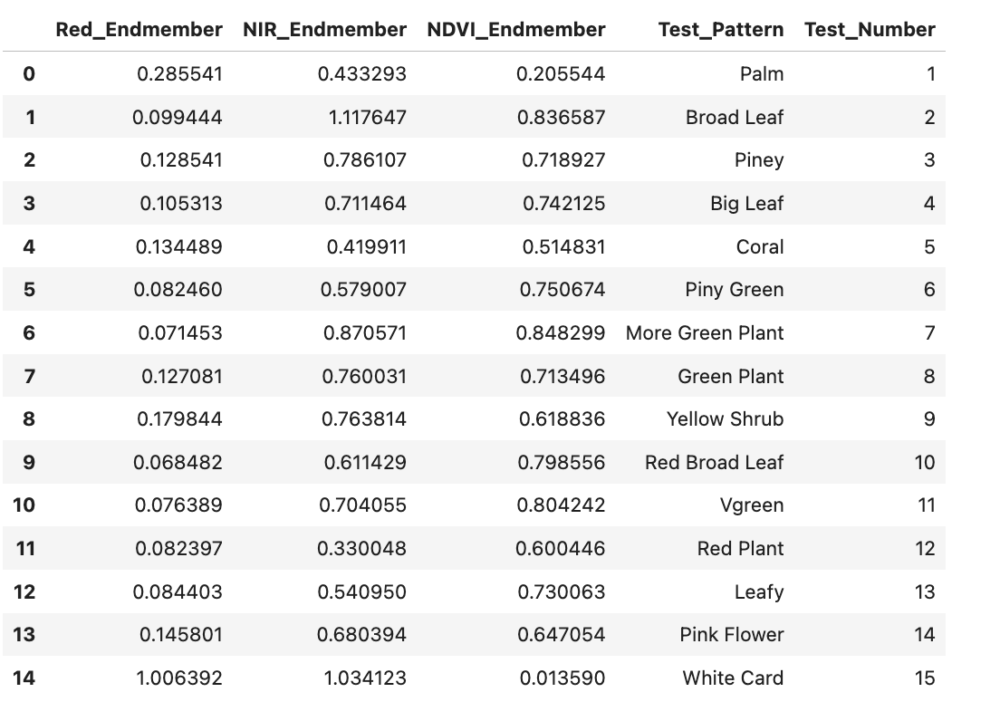

# STS-STELLA-Spectrometer-Readings-on-Plant-Species
---
The Science and Technology Society (STS) of Sarasota-Manatee Counties, FL have created a Jupyter Notebook to load raw STELLA-Q2 spectrometer data, white-card correct the wavelength data and then use **Decision Tree** and **Knn** to differentiate plant species based on the **mean End-Members** reference data where the **Normalized Difference Vegetative Index (NDVI)** is key to this analysis. NDVI is calculated:

    _NDVI = (Near IR irradiance – Red irradiance)/( Near IR irradiance + Red irradiance)_

The STELLA-Q2 is a NASA configured hand-held spectrometer designed by Paul Mirel at NASA. The unit is relatively inexpensive and is used to collect end member data that can then be used to calibrate Landsat interpretations. Mike Taylor of NASA heads up the STELLA team, and he and his entire team have been so immensely helpful as we delve into calibrated Landsat interpretations. 

In our notebooks we employ a few novel python methods using Altair and Panel to display the actual plant species images along the time-series NDVI data for each of the spectrometer readings. This helps us better understand the subtle differences in the STELLA data and calculated values. 

>
>
>
>

## **These are all of the vegetative species wavelength plots after the white-card corrections:**

>
>
>

## **The Decision Tree method allows us to better understand the logic use in differentiating one species from the other:**

>
>
>

## **These are the various mean End-Members for each species used with Knn:**

>
>
>

## **and these are the natural clusters for each species in red, near IR and NDVI space:**

>
>
>

We have also created a Jupyter Notebook (convert_ver4_clean.ipynb) to read in the raw STELLA data (data.csv) and create a series of Excel files that are easy to read and contain the raw data, white card corrected data as well as time-series and wavelength plots. We also create an Excel file that has the calculated NDVI time-series data and plots too.
