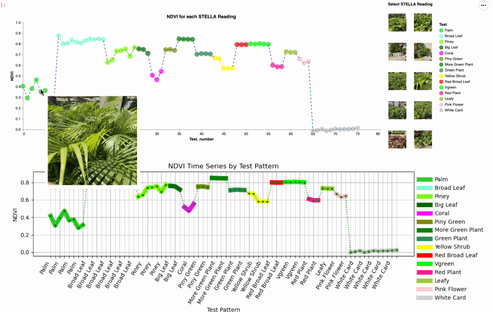

# STS-STELLA-Spectrometer-Readings-on-Plant-Species
This is a Science and Technology Society (STS) of Sarasota-Manatee Counties that shows the data from a series of NASA STELLA-Q2 Spectrometer readings on a number of vegetative species.

In our Jupyter Notebook we load the raw STELLA-Q2 spectrometer data, white card correct the wavelength data and then use Decision Tree and Knn to differentiate plant species based on the mean end member data. NDVI is key to this analysis. 

In addition, we use a novel method using python's Altair to show the plant species target images along the NDVI time-series data for all the spectrometer readings. 

We have also created a Notebook (convert_ver4_clean.ipynb) to read in the raw STELLA data and create a series of Excel files that are easy to read and contain raw data, white card corrected data as well as time-series and wavelength plots. We also have one Excel file that has the NDVI time-series data and plot.  
